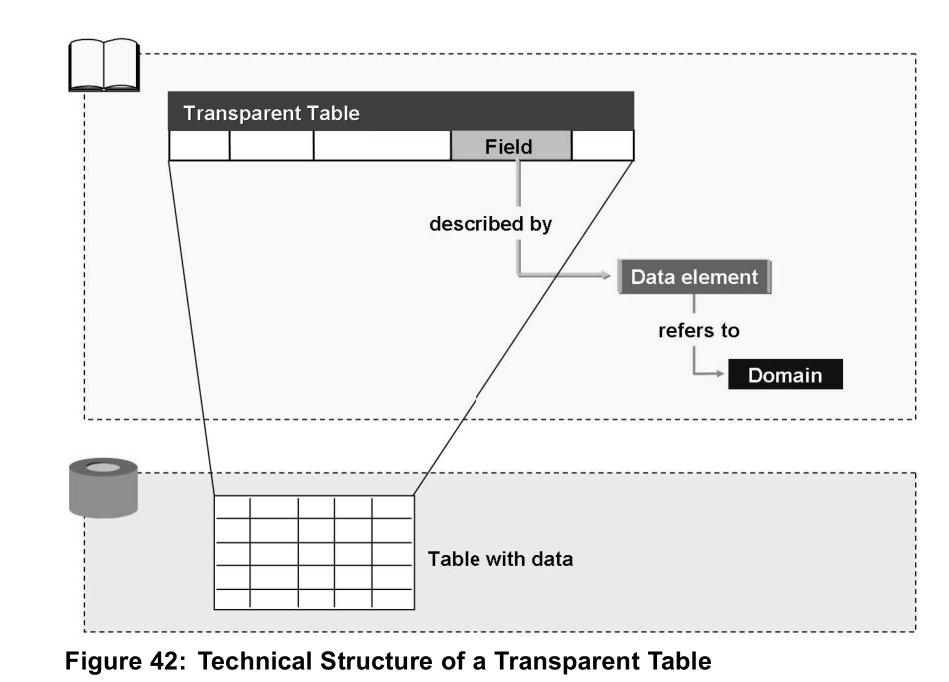
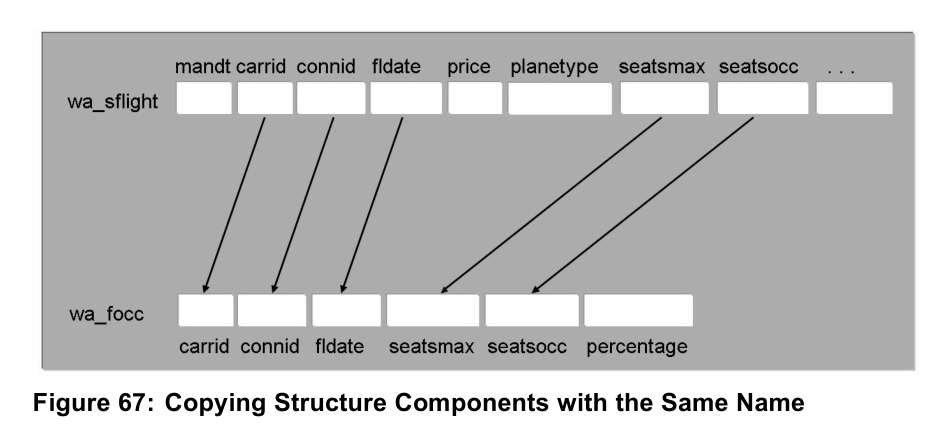

[TOC]

## 概述

### 受众

1. 项目团队成员
2. ABAP程序员

### 课程目标

1. 理解和使用ABAP基础语法元素
2. 实现不同类型的用户对话
3. 访问数据库的程序
4. 使用ABAP Workbench 开发工具
5. 理解开发是如何组织和传输的

### 所获能力

1. 建立包含用户对话和数据库访问的程序
2. 描述不同类型的开发对象及其典型用途
3. 使用恰当的工具创建上述开发对象的简单例子

## Unit1 ABAP 程序流程

### 系统架构和ABAP程序

## Unit2 ABAP 工作台介绍

### 单元目标

1. 描述仓库结构
2. 命名和使用仓库搜索工具
3. 使用对象导航器来显示仓库对象
4. 命名和使用旧软件开发工具
5. 创建包
6. 创建程序
7. 创建事务

### Lesson: 仓库和对象导航器

#### 仓库

1. 由系统所属有的开发对象组成，包括 **程序、函数模块、数据库表定义及其他对象**。
2. 属于数据库层，存储系统定义对象、用户定义对象
3. 独立于客户端，可被所有客户端访问
4. 仓库进一步细分**应用组件**，如FI, MM, CO, HR,SD……，每一个组件由多个**包**组成，**仓库对象**被创建后，必须分配至包中，仓库对象中还可以包含多子对象。

#### 应用表、自定义表

1. 依赖于客户端，因此有一个**client**列

#### 仓库搜索工具

1. TCODE: SE84，SE80 对象导航器，路径：工具-ABAP工作台-概览-信息系统
2. TCODE: SE81, 显示应用程序层次结构

#### 对象导航器

ABAP工作台中最重要的几个工具:

1. ABAP Editor: 编辑源代码
2. ABAP Dictionary: 编辑数据库表定义，中心数据类型等
3. Screen Painter: 配置屏幕（屏幕+函数构成用户会话）
4. Function Builder: 维护函数模块
5. Class Builder: 维护全局类和接口

### Lesson 开发程序和组织开发

1. TCODE: SE21, 包构建器

#### 开发一个ABAP程序

1. 创建程序
2. 创建事务
3. 激活程序
4. 创建事务

## Unit3 ABAP 字典介绍

### 单元目标

1. 解释应用开发中使用数据模型的目的和好处
2. 描述SAP flight 数据模型
3. 描述数据元素和域意义和结构
4. 描述透明表的意义和结构
5. 描述结构的意义和结构
6. 在你的ABAP程序中使用提到的字典元素

### Lesson ABAP字典中的数据建模和描述性元素

1. 透明表：表的定义

2. 数据元素：表中域（列）的描述

   1. 包括语义属性（域文档、标签）和技术属性（数据类型、域长度等，定义在域中）
   2. 用于程序内部变量定义、描述透明表域
   3. 可多表共用，确保数据一致

3. 域：定义表域的数据类型、长度等

4. 结构：描述包含多个表域的结构变量，与透明表类似，相比透明表，不包含主键和技术属性

   1. 可定义数据对象
   2. 结构可以嵌套，复合结构包含多个子结构，简单结构叫做扁平结构/组件（flat）

5. 数据对象：用于 程序中的临时数据存储、屏幕和程序间数据传输的接口

   上述三者之间的关系如图：

   


## Unit4 ABAP语言基本元素

### 单元目标

1. 定义元素数据对象（简单变量）
2. 使用带有元素数据对象的基本ABAP语句
3. 在调试模式下执行和分析程序
4. 定义结构化数据对象（结构变量）
5. 使用包含结构数据对象的ABAP语句
6. 在调试模式下分析结构数据对象
7. 定义内部表
8. 使用带有内部表的ABAP语句
9. 在调试模式下分析内部表

### Lesson 使用元素数据对象

1. 完全ABAP标准类型：SAP 预定义好，类型确定、长度固定
   1. 例如：D、T、I、F、STRING、XSTRING
2. 非完全ABAP标准类型，长度不固定
   1. 例如：C、N、X、P

### Lesson 使用结构

1. 定义

   1. 用字典结构定义结构数据对象（变量），例如：

      ```
      DATA wa_focc TYPE abc400focc.
      ```

   2. 用透明表定义结构数据对象，例如：

      ```
      DATA wa_spfli TYPE spfli.
      ```

   3. 在程序中声明本地结构类型，再定义结构数据对象，例如：

      ```
      TYPES: BEGIN OF st_flightinfo,
      		 carrid		TYPE s_carr_id,
      		 connid		TYPE s_conn_id,
      		 fldate		TYPE s_date,
      		 …………
      	   END OF st_flightinfo.
      DATA wa_flightinfo TYPE st_flightinfo.
      ```

      也可以直接定义结构数据对象，将关键字 **TYPES** 改为 **DATA** 即可，例如：

      ```
      DATA: BEGIN OF structure_name,
      		...,
      	  END OF structure_name.
      ```


   2. 使用连字符（-）获取结构中的字段值，例如：

      ```
      structure_name-component-name.
      ```

   3. 批量将一个结构数据对象赋值给另一个结构数据对象（同名字段赋值），使用 **MOVE-CORRESPONDING  ... TO ...** 命令，例如：

      ```
      DATA: wa_sflight TYPE sflight,
      	  wa_focc TYPE sbc400focc.
      MOVE-CORRESPONDING wa_sflight TO wa_focc.
      ```

      

      

### Lesson 使用内部表


## 培训

### 数据库层

WORKAREA

TABLE

STRUCTURE: 方便业务字段重用

ELEMENT: 有业务场景，实现业务和技术的统一

DOMAIN: 技术含义相同的字段用域定义

NAMESPACE: 命名空间，数据库表只能以 Y 或 Z开头，可向SAP公司申请授权命名空间

数据库增强: 每个表都有一个字段.INCLUDE，可以引入一个新的structure；或者append structure 

### 应用层


## 附录A 标点符号的英文

| 标点符号 |       英文写法        |
| :------: | :-------------------: |
|    :     |         colon         |
|    ;     |      semi-colon       |
|    .     |        period         |
|    ,     |         comma         |
|    *     |       asterisk        |
|    "     | double quotation mark |
|    '     | single quotation mark |
|    !     |      exclamation      |
|    ?     |     question mark     |
|    -     |        hyphen         |

## 附录B 名词解释

|     英    文      | 中    文 |
| :---------------: | :------: |
|      program      |   程序   |
|    transaction    |   事务   |
|    repository     |  资源库  |
|      package      |    包    |
|    data model     | 数据模型 |
|   data element    | 数据元素 |
|      domain       |    域    |
| transparent table |  透明表  |
|     structure     |   结构   |
|    data object    | 数据对象 |


